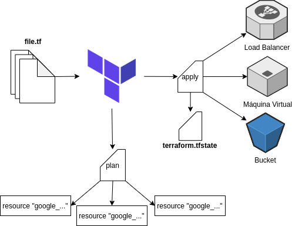

# Conceitos Iniciais

## O que é Infraestrutura como Código?

Infraestrutura como Código ou *Infrastructure as Code* (IaC) é a utilização de uma linguagem de codificação descritiva de alto nível com a intenção de automatizar o provisionamento de uma infraestrutura para armazenamento de *software*. Essa automatização possibilita que desenvolvedores não precisem provisionar e gerenciar servidores manualmente, operar sistemas, conexões de banco de dados, armazenamento, além de outros elementos da infraestrutura sempre que precisam desenvolver, testar e realizar o deploy de aplicações. IaC também é uma
prática essencial do **DevOps** sendo indispensável para um ciclo de vida de entrega de **software** de forma acelerada.

## O que é o Terraform?

O Terraform é uma ferramenta utilizada como **IaC** que permite o **provisionamento, configuração e gerenciamento de infraestrutura** por meio do uso de uma **linguagem descritiva**. Essa ferramenta:

- É de Código Aberto (Open Source);
- Utiliza **linguagem declarativa**, ou seja, uma linguagem que define o resultado final a que se deseja chegar, sem a necessidade de explicitar como (passo a passo) deve-se chegar a esse resultado.

Assim, pode-se dizer que o Terraform é uma ferramenta para **provisionamento de infraestrutura**.

## Arquitetura do Terraform

A arquitetura do Terraform é dividida nos seguintes componentes:

- **sources**
- **providers**

As **sources** são divididas em duas fontes de entradas de informação para realização das tarefas de configuração necessárias, que são:

- **TF-config** - arquivo **.tf** que define o que **criar/configurar** para que a infraestrutura atual passe para o estado desejado.
- **State** - arquivo **.tfstate** que mantém o estado atual da configuração.

Ao realizar a comparação entre **TF-config** e o **State** o Terraform define o que deve ser criado, atualizado ou destruído para que a infraestrutura passe do estado atual para o estado desejado.

Com um provider definido é possível acessar diferentes **resources** presentes nele. Cada provider possui seus próprios *resources* que podem ser utilizados na configuração da infraestrutura por meio do Terraform.
