# Parte 1 - Entendendo o Terraform com Local Files

O Terraform utiliza **_providers_** e seus **_resources_** como recursos principais e, para um entendimento inicial de como funciona a ferramenta, pode-se utilizar o _resource_ **_local_file_**, para a criar ou editar arquivos. Esse _resource_ faz parte do _provider_ local, ou seja, a própria máquina do usuário onde está sendo executada a ferramenta. Dessa forma, ao utilizar esse tipo de _resource_, todas as modificações serão realizadas na própria máquina do usuário.

## Primeiro Código e Como Executá-lo

Para se iniciar, dentro de uma pasta à sua escolha é necessário criar o primeiro arquivo de configuração **_.tf_**, que pode ser, por exemplo, **_main.tf_**. Dentro desse arquivo será criado o seguinte código:

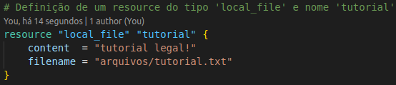

No código acima temos:

1. A definição de um resource do tipo ```local_file``` com nome ```tutorial```. Lembrando que um _resource_ do Terraform leva sempre a estrutura:

```
    resource "tipo_do_resource" "nome_do_resource" {
        parametro_1 = valor
        parametro_2 = valor
        ...
    }
```

2. A utilização do parâmetro ```content```, referente ao conteúdo do arquivo que será criado, com o valor ```tutorial legal!```.
3. A utilização do parâmetro ```filename```, referente ao caminho e nome do arquivo que será criado, com o valor ```arquivos/tutorial.txt```.

Com o código devidamente criado, e, utilizando da linha de comando do sistema operacional da sua máquina, para executá-lo deve-se:

1. Rodar o comando ```terraform plan```, que irá fazer um levantamente de quais mudanças precisam ser feitas para atingir o resultado desejado. Ao executá-lo o resultado mostrado na linha de comando será semelhante à:
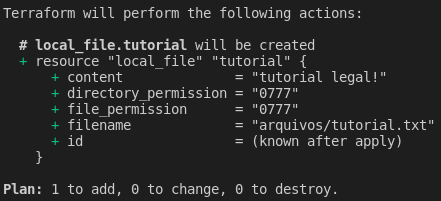

2. Em seguida, deve-se executar o comando ```terraform apply```, que irá de fato executar as mudanças planejadas após o ```terraform plan```. o resultado mostrado na linha de comando será semelhante à:
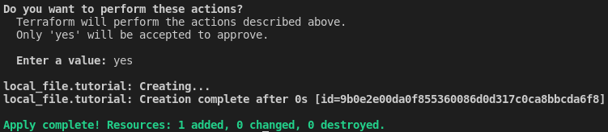
Além disso, será criado o primeiro arquivo ```terraform.tfstate```, que irá armazenar o novo estado atual da infraestrutura. O conteúdo do arquivo será semelhante à:
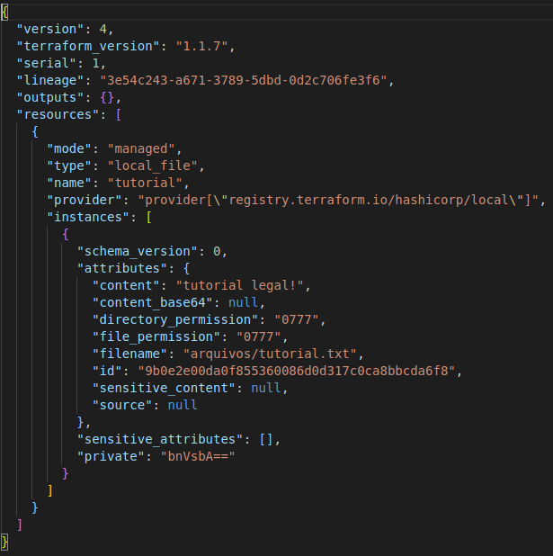

Assim, o resultado final após a execução desse código será a criação de um arquivo chamado ```tutorial.txt``` dentro da pasta ```arquivos```, que também será criada, e com o conteúdo sendo a frase ```tutorial legal!```.

## Alterando o Código e Mudando o State

Após a execução de um código inicial, obtém-se uma mudança na infraestrutura, que nesse caso é a criação de um novo arquivo ```tutorial.txt``` na pasta ```arquivos```, ocorrido localmente.
Com isso, foi gerado o arquivo de estado atual da infraestrutura, que é
o ```terraform.tfstate```. Agora, adicionamos o seguinte código no arquivo de configuração já existente:
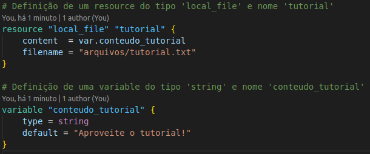

No código acima temos a adição de um recurso ```variable```, de nome ```conteudo_tutorial```. Esse recurso nos permite atribuir variáveis ao código para utilização em diferentes locais que hajam a necessidade de informações facilmente recuperáveis.

As definições do tipo _variable_ possuem a seguinte estrutura:

```
    data "nome" {
        parametro_1 = valor
        parametro_2 = valor
        ...
    }
```

Para esse bloco, utilizando ```variable```, temos:

1. O parâmetro ```type```, cujo o valor será o tipo da variável desejado.
2. O parâmetro ```default```, onde o valor será o conteúdo a ser armazenado na variável.

Com o novo incremento ao código devidamente realizado, os passos são:

1. Rodar o comando ```terraform plan```, cujo resultado mostrado na linha de comando será semelhante à:
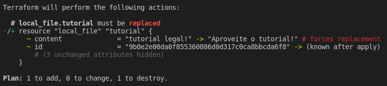

2. Em seguida, deve-se executar o comando ```terraform apply``` para efetivação das mudanças.

Com as mudanças aplicadas à infraestrutura, teremos:

1. A atualização do arquivo ```terraform.tfstate``` para algo semelhante à:
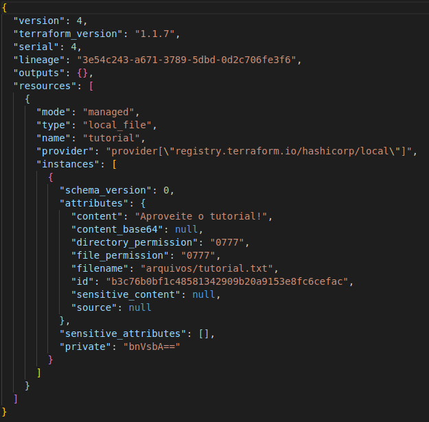
2. A criação de um arquivo de _backup_ do _state_ anterior chamado ```terraform.tfstate.backup```, que terá conteúdo semelhante à:
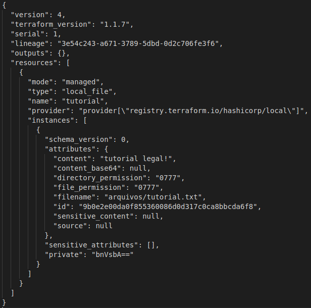

Assim, o resultado final após a execução desse código será a mudança do arquivo ```tutorial.txt``` com o novo conteúdo passando a ser a frase ```Aproveite o tutorial!```.

## Realizando um Print de Conteúdo

Uma utilização interessante de recursos do Terraform é a visualização de informações na linha de comando utilizando um tipo de ```print```. Para isso, adicionamos o seguinte código no arquivo de configuração:
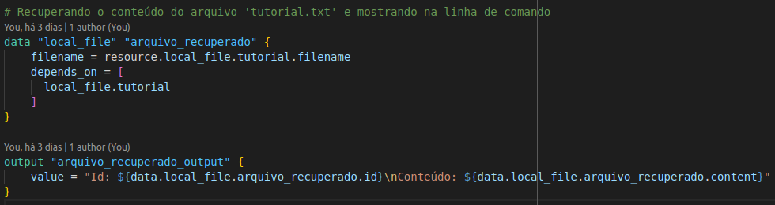

No código acima temos a utilização de dois outros recursos presentes no Terraform, que são ```data```, do tipo ```local_file``` e nome ```arquivo_recuperado```, e um ```output```, de nome ```arquivo_recuperado_output```.

As definições do tipo _data_ possuem a seguinte estrutura:

```
    data "tipo" "nome" {
        parametro_1 = valor
        parametro_2 = valor
        ...
    }
```

Já as definições do tipo _output_ ficam:

```
    data "nome" {
        parametro_1 = valor
        parametro_2 = valor
        ...
    }
```

Para o bloco do tipo ```data``` temos:

1. O parâmetro ```filename```, cujo o valor será o caminho e nome do arquivo do qual desejamos obter o conteúdo.
2. O bloco ```depends_on``` para informar que a execução desse bloco ```data``` depende da execução prévia do bloco que cria o arquivo desejado.

Para o bloco do tipo ```output``` temos:

1. O parâmetro ```value```, cujo o valor será o conteúdo que desejamos mostrar na linha de comando como um ```print```.

Com o novo incremento ao código devidamente realizado, os passos são:

1. Rodar o comando ```terraform plan```, cujo resultado mostrado na linha de comando será semelhante à:
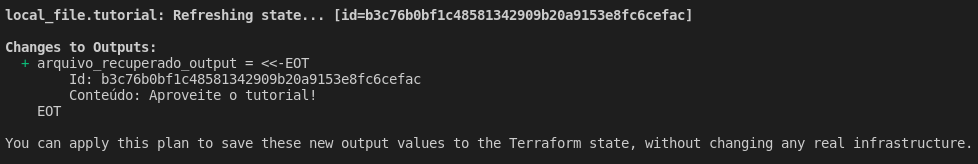

2. Em seguida, deve-se executar o comando ```terraform apply```, onde o resultado mostrado na linha de comando será semelhante à:
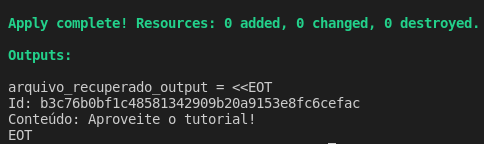

Assim, o resultado final após a execução desse código será a leitura do conteúdo do arquivo ```tutorial.txt``` e a exibição do seu ```id``` e conteúdo na linha de comando.

A próxima etapa do tutorial introduz a utilização do Terraform definindo um _provider_ não local e pode ser acessada [aqui](../parte2/main.md).
