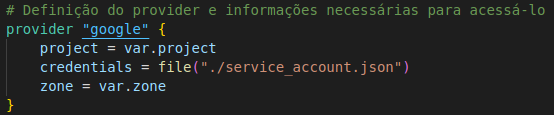
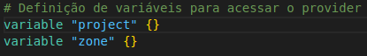
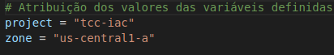
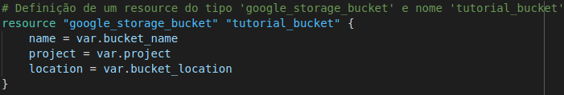
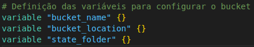
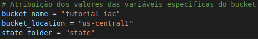
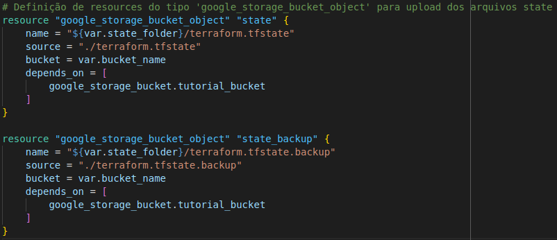

# Parte 2 - Google Cloud Storage

Agora, com um entendimento prévio de como funcionam os _resources_ no Terraform utilizando o _provider_ local, podemos verificar a utilização dos _resources_ por meio de um _provider_ externo, nesse caso, o [Google Cloud Platform](https://cloud.google.com/). Para isso, assume-se que o usuário possui uma [conta de serviço](https://cloud.google.com/iam/docs/service-accounts?hl=pt-br), que pode ser criada seguindo a documentação da plataforma.

## Definindo o Provider Google Cloud

Para se iniciar, dentro de uma pasta à sua escolha é necessário criar o primeiro arquivo de configuração do _provider_ com nome  **_provider.tf_**. Ao contrário do que foi feito na [Parte 1](../parte1/main.md), dessa vez criaremos o projeto com separação de arquivos por função a fim de manter uma boa organização do código, de acordo com boas práticas de utilização do Terraform. Assim, dentro do arquivo criado colocaremos o seguinte código:



No código acima temos:

1. A definição do _provider_  ```google```. Lembrando que um _provider_ do Terraform leva sempre a estrutura:

```
    provider "nome_do_provider" {
        parametro_1 = valor
        parametro_2 = valor
        ...
    }
```

2. A utilização do parâmetro ```project```, referente ao nome do projeto que será utilizado no Google Cloud, com o valor ```var.project```.
3. A utilização do parâmetro ```credentials```, referente ao arquivo **_.json_** contendo as credenciais da conta de serviço do usuário. Nesse caso, o valor da variável é especificado como ```file(./service_account.json)```. A utilização do método ```file()``` é para garantir que o valor desejado seja buscado de um **arquivo** localizado no caminho passado.
4. A utilização do parâmetro ```zone```, referente à zona onde deverá estar armazenado o projeto utilizado, com o valor ```var.zone```.

É possível notar que no código acima os parâmetro ```project``` e ```zone``` foram configurados com valores vindos de variáveis ainda não especificadas. Para obter essas variáveis, iremos criar o arquivo que irá contê-las, com nome **_variables.tf_**. Dentro do arquivo criado teremos o seguinte código:



Nesse código temos:

1. A definição da _variable_ ```project``` sem especificação de nenhum parâmetro.
2. A definição da _variable_ ```zone``` sem especificação de nenhum parâmetro.

Com isso, temos as variáveis criadas, porém é necessário especificar os valores que serão atribuídos a elas. Para isso, criaremos o arquivo ```terraform.tfvars```, que possui a extensão **_.tfvars_** que é específica para um arquivo onde serão atribuídos valores à variáveis do Terraform. Nesse arquivo teremos o seguinte código:



Nesse código temos:

1. A atribuição do valor ```tcc-iac``` à variável ```project```. Lembrando que pode ser atribuído qualquer nome a essa variável.
2. A atribuição do valor ```us-central1-a``` à variável ```zone```.

Com todos os arquivos gerados corretamente, basta executar o ```plan```, para que o Terraform entenda quais mudanças devem ser realizadas para chegar ao estado desejado, e em seguida o ```apply```, para realização das mudanças planejadas.

Assim, o resultado final após a execução desse código será a criação de um projeto chamado ```tcc-iac``` dentro do Google Cloud. É importante saber que todos os arquivos **_.tf_** disponíveis na pasta onde está sendo executado o Terraform serão levados em consideração durante a criação/modificação da infraestrutura, o que torna possível a separação do código em diferentes arquivos, como foi realizado.

## Adicionando um Bucket ao Projeto

Após a definição do _provider_ e criação do projeto, podemos adicionar um _bucket_ ao projeto existente no Google Cloud. Para isso, criaremos um arquivo chamado **_google_storage.tf_** onde serão realizadas as operações com _resources_ do _provider_ ```google```. Com o arquivo criado, adicionaremos o seguinte trecho de código:



No código acima temos:

1. A definição do _resource_  ```google_storage_bucket``` de nome ```tutorial_bucket```.
2. A utilização do parâmetro ```name```, referente ao nome do _bucket_ que será criado no Google Cloud, com o valor ```var.bucket_name```.
3. A utilização do parâmetro ```project```, referente ao nome do projeto onde o _bucket_ será criado, com o valor ```var.project```.
4. A utilização do parâmetro ```location```, referente á localização do _bucket_ que será criado, com o valor ```var.bucket_location```.

Para obter as variáveis utilizadas como valor nos parâmetros do _resource_, no arquivo **_variables.tf_**, adicionaremos o seguinte código:



Nesse código temos:

1. A definição da _variable_ ```bucket_name``` sem especificação de nenhum parâmetro.
2. A definição da _variable_ ```bucket_location``` sem especificação de nenhum parâmetro.
3. A definição da _variable_ ```state_folder``` sem especificação de nenhum parâmetro.

Para especificar os valores que serão atribuídos às variáveis, no arquivo **_terraform.tfvars_**, adicionaremos o seguinte código:



Nesse código temos:

1. A atribuição do valor ```tutorial_iac``` à variável ```bucket_name```.
2. A atribuição do valor ```us-central1``` à variável ```bucket_location```.
3. A atribuição do valor ```state_folder``` à variável ```state```.

Agora podem ser executados os comandos ```plan``` e ```apply```. Assim, o resultado final após a execução desse código será a criação de um _bucket_ chamado ```tutorial_iac``` dentro do projeto```tcc-iac```.

## Adicionando Arquivos ao Bucket

Após a criação do _bucket_ podemos realizar ações dentro dele, como a adição de arquivos. Para isso, adicionaremos o seguinte trecho de código:



No código acima temos a definição de 2 _resources_ similares. No primeiro temos:

1. A definição do _resource_  ```google_storage_bucket_object``` de nome ```state``` para a criação/modificação de um objeto dentro de um determinado _bucket_.
2. A utilização do parâmetro ```name```, referente ao caminho e nome do arquivo que será adicionado ao _bucket_, com o valor ```${var.state_folder}/terraform.tfstate```.
3. A utilização do parâmetro ```source```, referente ao caminho e nome do arquivo local que será utilizado como fonte (copiado) para se obter o conteúdo do arquivo criado no _bucket_, com o valor ```./terraform.tfstate```.
4. A utilização do parâmetro ```bucket```, referente ao nome do _bucket_ utilizado, com o valor ```var.bucket_name```.
5. A utilização do parâmetro ```depends_on``` para indicar que a aplicação deste _resource_ depende da aplicação prévia do _resource_ ```google_storage_bucket.tutorial_bucket```.

Para o segundo _resource_ temos:

1. A definição do _resource_  ```google_storage_bucket_object``` de nome ```state_backup```.
2. A utilização do parâmetro ```name```, com o valor ```${var.state_folder}/terraform.tfstate.backup```.
3. A utilização do parâmetro ```source```, com o valor ```./terraform.tfstate.backup```.
4. A utilização do parâmetro ```bucket```, com o valor ```var.bucket_name```.
5. A utilização do parâmetro ```depends_on``` para indicar que a aplicação deste _resource_ depende da aplicação prévia do _resource_ ```google_storage_bucket.tutorial_bucket```.

Nesse caso, a única variável nova utilizada é ```state_folder``` que já foi definida anteriormente. Com isso, podem ser executados os comandos:

```
terraform init
terraform plan
terraform apply
```

Por fim, o resultado final após a execução desse código será a cópia dos arquivos locais **_terraform.tfstate_** e **_terraform.tfstate.backup_** para dentro da pasta **_state_** do _bucket_ ```tutorial_iac```.

A próxima etapa do tutorial introduz a utilização da Compute Engine do Google para configuração de máquinas virtuais com determinadas configurações e pode ser acessada [aqui](../parte3/main.md).
