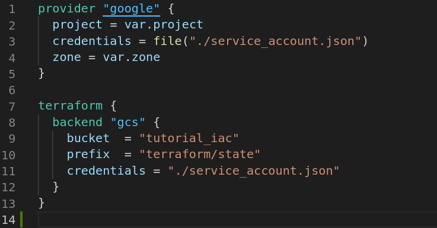

# Google Compute Engine
- Nesse tópico iremos criar um compute engine no google cloud, como foi explicado no tópico 2 sobre como utilizar o provider irei focar mais na contrução do _resource_ de _compute_ _engine_.
- O  _compute_ _engine_ da google é equivalente ao criar uma máquina virtual, essas máquinas virtuais são normalmente usadas como servidores de aplicações onde é possível hospedar uma aplicação e acessar através da internet.
## Explicando o código
### Provider
- Para criar o  _compute_ _engine_ precisaremos utilizar novamente o provider da google, mas nesse momento iremos introduzir um conceito importante que é o conceito de backend.
- Para explicar melhor vamos analisar uma situação hipotética, vamos pensar que trabalhamos em uma empresa que utiliza terraform e que o João fez uma alteração estrutura e agora o seu _terraform.tf.state_ tenha mudado, e a maria que que tbm executou um mudança tenha modificado a estrutura de uma forma diferente que o João, como eles vão poder trabalhar em paralelo sem nenhum sobrescrever a mudança um do outro ? A resposta é simples, graças ao terraform. Podemos utilizar o conceito de backend, que nesse caso nos permite usar um storage para salvar as modificações que forem feitas, então antes de qualquer desenvolvedor tentar rodar, o nosso terraform vai usar o terraform que vai dar pull no storage como  _terraform.tf.state_ e depois atualizar  _terraform.tf.state_ que está com storage, com a mudança que acabou de ser feita.



- Analisando a imagem acima vemos que temos a definição do provider como foi explicado anteriormente e a nossa definição de backend.

```
terraform {
  backend "gcs" {
    bucket  = "tutorial_iac"
    prefix  = "terraform/state"
    credentials = "./service_account.json"
  }

```

- Agora que entendomos como funciona o nosso backend e como ele é importante para a gestão do arquivo  _terraform.tf.state_ vamos entrar na parte de criação do nosso resource.

### Compute engine
- Para criarmos nosso resource, vamos primeiramente entender as envs que vão ser utilizadas dentro do nosso resource.
IMAGEM DAS VARS

|  Variável |Definição   |
|---|---|
|zone   |   É a zona de disponibilidade onde iremos alocar nossa máquina virtual|
| project  | É o nome do nosso projeto no google cloud plataform   |
| vm_name  | É o nome que daremos a nossa máquina virtual  |
|machine_type| É o tipo de máquina que vamos escolher, é possível criar máquinas com recursos diferentes(vcpu e memória), nesse caso usaremos uma máquina média|
|image_so| É a imagem do Sistema operacional, nesse caso usaremos o debian-9|

- Agora que todas as variáveis estão mapeadas podemos ver o arquivo que define o nosso _compute_ _engine_.


```
resource "google_compute_instance" "my-first-vm" {
  name         = var.vm_name
  machine_type = var.machine_type
  zone         = var.zone
  boot_disk {
    initialize_params {
      image = var.image_so
    }
  }
  network_interface {
    network = "default"

    access_config {
      // Ephemeral public IP
    }
  }
  metadata_startup_script = "echo 'criando vm' > /test.txt"

}
```

Agora que entendemos todos os aquivos que compõe a criação do no _resource_ vamos executar os comandos abaixo:

```
terraform init
terraform plan
terraform apply
```

E teremos o seguinte retorno:


- Agora se formos no console do google cloud e clicarmos em compute_engine vamos ver a nossa máquina virtual criada.
- Para acessar a máquna virtual basta colar o comando que do gcloud no terminal
