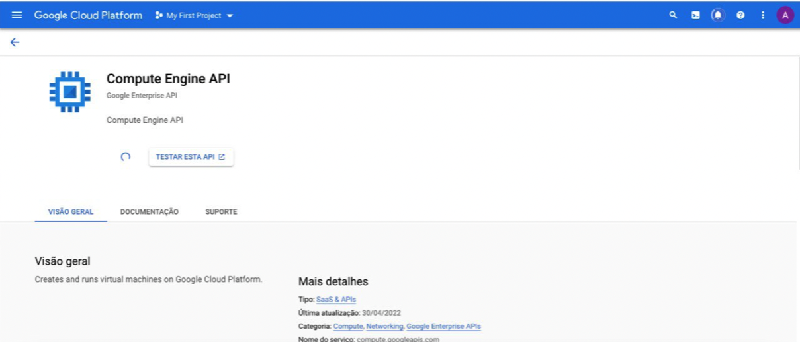

# Parte 3 - Google Compute Engine

Após o primeiro acesso ao **Google Cloud**, nesse tópico, iremos criar um _compute engine_ no _google cloud_. Como foi explicado no tópico 2 sobre como utilizar o _provider_ esse tópico será focado na contrução do _resource_ de _compute_ _engine_.
A  _compute_ _engine_ do google é equivalente a uma máquina virtual. Essas máquinas virtuais são normalmente usadas como servidores de aplicações onde é possível hospedar uma aplicação e acessar através da _internet_.
É importante dizer que cada tutorial será feito em uma pasta diferente, então crie uma pasta para a parte que será explicada nessa página.
Caso tenha alguma dúvida pode consultar o código fonte que está nesse [link](https://github.com/DevOps-para-iniciantes/IaC/tree/master/parte3)

## Provider com Backend

Para criar a _compute_ _engine_ precisaremos utilizar novamente o _provider_ ```google```, mas nesse momento iremos introduzir um conceito importante que é o de **_backend_**.
Para explicar melhor, vamos analisar uma situação hipotética. Ao pensar que trabalhamos em uma empresa que utiliza _terraform_ e que o João fez uma alteração de estrutura agora o seu _terraform.tf.state_ mudou. Supondo, também, que a Maria também executou um mudança modificando a estrutura de uma forma diferente que o João. Com isso, como eles vão poder trabalhar em paralelo sem nenhum sobrescrever a mudança do outro? A resposta é simples, graças ao _terraform_, e para isso podemos utilizar o conceito de _backend_, que nesse caso nos permite usar um _storage_ para salvar as modificações que forem feitas. Então, quando qualquer desenvolvedor tentar rodar o _terraform_ localmente, será realizado um _pull_ no _storage_ para obtenção do arquivo  ```_terraform.tf.state_``` atual e somente depois será atualizado o ```_terraform.tf.state_``` que está no _storage_ com a mudança que acabou de ser feita. Para realizar a configuração do _backend_, no arquivo **_provider.tf_**, podemos utilizar o seguinte código:


Analisando a imagem acima vemos a definição do **_provider_**, como foi explicado anteriormente, e a nossa definição do **_backend_** da seguinte forma:

```
terraform {
  backend "gcs" {
    bucket  = "tutorial_iac"
    prefix  = "terraform/state"
    credentials = "./service_account.json"
  }
}

```
OBS: Utilize o mesmo nome do bucket que usou anteriormente na parte 2.

Agora que entendemos como funciona o nosso _backend_ e como ele é importante para a gestão do arquivo  ```_terraform.tf.state_``` vamos entrar na parte de criação do nosso _resource_.

## Resource Compute Engine

Para criarmos nosso **_resource_**, vamos primeiramente entender as variáveis, definidas no arquivo **_variables.tf_** e atribuídas em **_terraform.tfvars_**, que vão ser utilizadas dentro dele. Para isso, temos a seguinte tabela:

|  Variável |Definição   |
|---|---|
|```zone```   |   É a zona de disponibilidade onde iremos alocar nossa máquina virtual|
| ```project```  | É o nome do nosso projeto no google cloud plataform   |
| ```vm_name```  | É o nome que daremos a nossa máquina virtual(pode dar qualquer nome que quiera) |
|```machine_type```| É o tipo de máquina que vamos escolher, é possível criar máquinas com recursos diferentes(vcpu e memória), nesse caso usaremos uma máquina média("e2-medium")|
|```image_so```| É a imagem do Sistema operacional, nesse caso usaremos o debian-9("debian-cloud/debian-9")|

Agora que todas as variáveis estão mapeadas podemos criar o arquivo **_compute_engine.tf_** e adicionar o seguinte código que define a nossa **_compute_ _engine_**:


```
resource "google_compute_instance" "my-first-vm" {
  name         = var.vm_name
  machine_type = var.machine_type
  zone         = var.zone
  boot_disk {
    initialize_params {
      image = var.image_so
    }
  }
  network_interface {
    network = "default"

    access_config {
      // Ephemeral public IP
    }
  }
  metadata_startup_script = "echo 'criando vm' > /test.txt"

}
```
Agora, antes de executarmos os comandos de execução do terraform, é necessário fazer algo diferente dos *resources* anteriores. Para criar uma máquina virtual no ***Compute Engine*** é necessário acessar a API no **Google Cloud** e ativar, para que o terraform possa se comunicar com a API do **Compute Engine** e seja criada. Para ativar a API, basta ir na aba de pesquisa e procurar por **Compute engine** e ativá-la, como mostra as imagens abaixo:

Agora que entendemos todos os códigos que compõem a criação do no _resource_ vamos executar os comandos já conhecidos, que são:

```
terraform init
terraform plan
terraform apply
```

Após executá-los, teremos o seguinte retorno na linha de comando:


E no Google Cloud será:


Assim, utilizando o **_console_** do Google Cloud e clicando em **Compute Engine** veremos a nossa máquina virtual criada. Para acessar a máquna virtual, basta copiar o comando visível na plataforma, colar no terminal e executá-lo.

A próxima etapa do tutorial é referente a utilização de Clusters do Kubernetes e pode ser acessada [aqui](../parte4/main.md).
