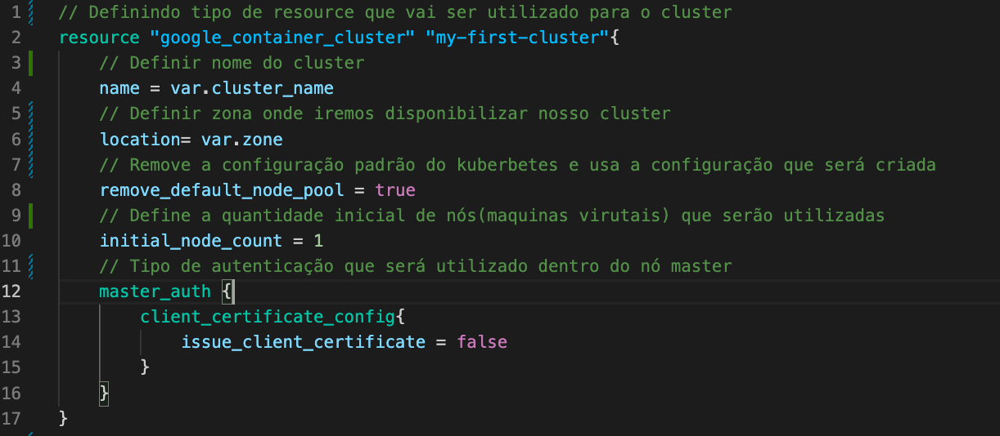
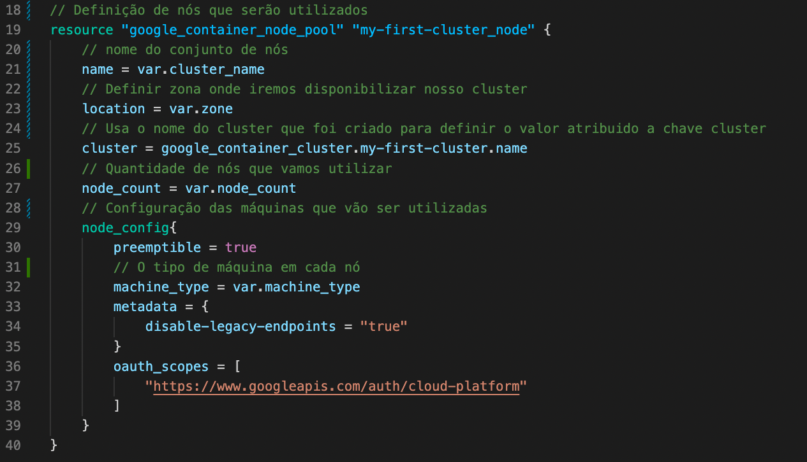
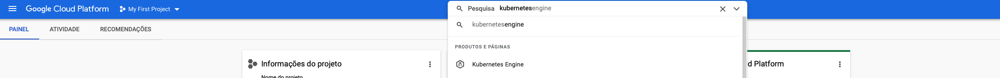
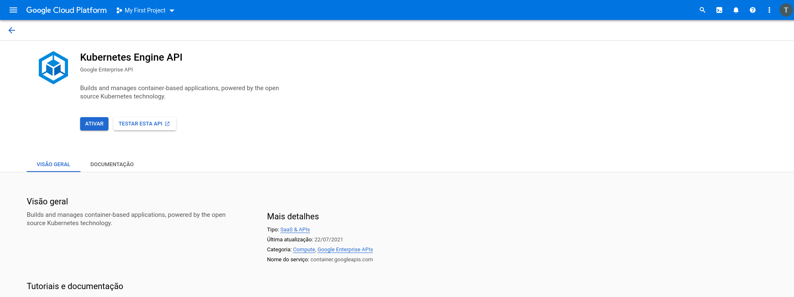
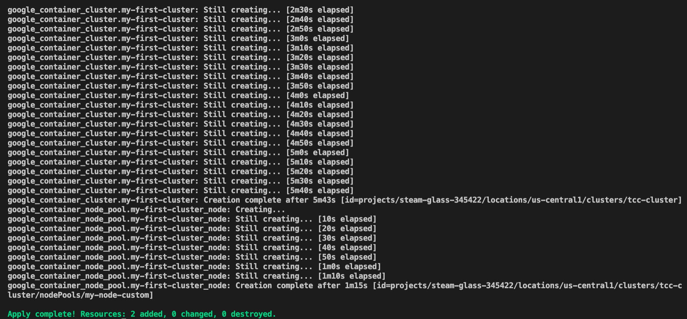
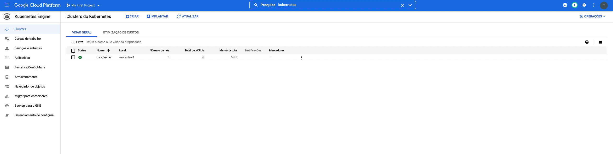

# Utilização de Clusters

Nesse tópico será exemplificado como podemos criar um __*cluster*__ de [Kubernetes](https://kubernetes.io/pt-br/docs/concepts/overview/what-is-kubernetes/) utilizando o terraform de forma simples e rápida. Para aqueles que não sabem, o kubernetes é uma ferramenta de orquestração de *containers*. A criação de um *cluster* tem a finalidade principal de explicar o *resource* que utiliza algumas *compute engines*, tema da [parte 3](../parte3/main.md).
É importante dizer que cada tutorial será feito em uma pasta diferente, então crie uma pasta para a parte que será explicada nessa página.
Caso tenha alguma dúvida pode consultar o código fonte que está nesse [link](https://github.com/DevOps-para-iniciantes/IaC/tree/master/parte4)
## Provider utilizado

Os *provider* que utilizaremos são os mesmos da parte anterior e, por esse motivo, não será explicado nessa parte detalhes de sua implementação.

## Kubernetes Engine

Para criar um **kubernetes engine** é necessário ter as seguintes variáveis definidas:

|  Variável |Definição   |
|---|---|
|zone   |   É a zona de disponibilidade onde iremos alocar nossa máquina virtual|
| project  | É o nome do nosso projeto no Google Cloud Plataform   |
| cluster_name  | É o nome que daremos ao nosso *cluster*  |
|machine_type| É o tipo de máquina que vamos escolher, sendo possível criar máquinas com recursos diferentes (vcpu e memória). Nesse caso usaremos uma máquina média|
|node_count| É a quantidade de nós (máquinas virtuais) que iremos ter dentro do nosso *cluster*|

Após definir essas variáveis no arquivo `terraform.tfvars` teremos o arquivo `cluster.tf`, onde ficarão as configurações referentes ao *cluster* kubernets.

Nesse exemplo, utilizaremos 2 *resources* diferentes para compor o kubernetes. O motivo é para que sejam mostrados alguns detalhes sobre como utilizar resultados da criação de um recurso com outros, criando, assim, uma dependência.

O primeiro recurso que criado é o ***cluster***, onde temos o código abaixo:


  
Podemos ver a definição de cada recurso e um comentário sobre cada linha onde fica claro a importância de cada variável para a criação desse *resource*.

O segundo *resource* que será criado é o ***node poll**, que é responsável por definir quais e quantas máquinas utilizaremos na criação do _cluster_, como mostra a imagem abaixo:




É importante ressaltar que nesse *resource* usamos algo um pouco diferente do que estamos acostumado. É possível notar que na linha 25 temos o seguinte:

```
cluster = google_container_cluster.my-first-cluster.name
```

Essa forma de escrever o arquivo **.tf** nos permite pegar um dado de um recurso que será criado em tempo de execução. Assim, supondo que nesse caso fosse necesário um **id** do *resource* seria muito complicado saber antes de criá-lo. Por esse motivo, podemos definir valores para outros recursos informando `tipo_do_resource.nome_do_resource.variavel_do_resource`.

Agora, antes de executarmos os comandos de execução do terraform, é necessário fazer algo diferente dos *resources* anteriores. Para criar um cluster no ***kubernetes engine*** é necessário acessar a API no **Google Cloud** e ativar, para que o terraform possa se comunicar com a API do **kubernetes engine** e seja criada. Para ativar a API, basta ir na aba de pesquisa e procurar por **kubernets engine** e ativá-la, como mostra as imagens abaixo:





Após a ativação, é necessário esperar por volta de 3 minutos pois demora um tempo até a API ficar disponível para acesso. Com isso, iremos executar os comando de execução do terraform.

Agora que entendemos todos os aquivos que compõe a criação do no _resource_, vamos executar os comandos abaixo:

```
terraform init
terraform plan
terraform apply
```

Teremos os seguintes resultados no **terminal**:



Teremos, também, o seguinte resultado no **Google Cloud**:


## Extra

Para acessar o ***cluster*** após estar com o **Google Cloud** totalmente configurado, basta executar o seguinte comando no **terminal**:

```
    gcloud container clusters get-credentials ${cluster_name} --region ${zone} --project ${project}
```

**Obs.**: substitua os valores entre `${}` pelos respectivos valores que foram setados dentro do `terraform.tf.vars`. Nesse caso, usando o `cluster_name` como `tcc-cluster`, a `zone` como `us-central1` e o `project`como `steam-glass-345422`, o comando fica dessa forma:

```
gcloud container clusters get-credentials tcc-cluster --region us-central1 --project steam-glass-345422
```

Para excluir tudo que foi criado basta rodar o comando:

```
terraform destroy
```
A próxima etapa do tutorial é referente à utilização de módulos e pode ser acessada [aqui](../parte5/main.md).
