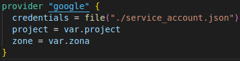
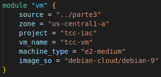
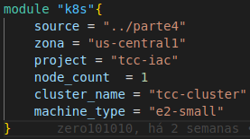

# Utilização de Módulos

## Definindo os Módulos

Para se iniciar, como vimos anteriormente, criaremos o arquivo de configuração do _provider_ com nome  **_provider.tf_**. Dentro do arquivo criado colocaremos o seguinte código:



O código do _provider_ segue a mesma estrutura e parâmetros já explicados anteriormente. Assim, em seguida criaremos o arquivo **_main.tf_** que irá possuir a configuração dos módulos utilizados. Nesse caso, assumiremos como módulos os códigos da [Parte 3](../parte3/main.md) e da [Parte 4](../parte4/main.md). No arquivo criado adicionaremos, para o módulo referente à **parte 3**, o seguinte código:



No código acima temos:

1. A definição do _module_  ```vm```. Lembrando que um _module_ do Terraform leva sempre a estrutura:

```
    provider "nome_do_modulo" {
        parametro_1 = valor
        parametro_2 = valor
        ...
    }
```

2. A utilização do parâmetro ```source``` de valor ```../parte3```.
3. A utilização do parâmetro ```zone``` de valor ```us-central1-a```.
4. A utilização do parâmetro ```project``` de valor ```tcc-iac```.
5. A utilização do parâmetro ```vm_name``` de valor ```tcc-vm```.
6. A utilização do parâmetro ```machine_type``` de valor ```e2-medium```.
7. A utilização do parâmetro ```image_so``` de valor ```debian-cloud/debian-9```.

Para o módulo referente à **parte 4**, adicionaremos o seguinte código:



No código acima temos:

1. A definição do _module_  ```k8s```.
2. A utilização do parâmetro ```source``` de valor ```../parte3```.
3. A utilização do parâmetro ```zona``` de valor ```us-central1-a```.
4. A utilização do parâmetro ```project``` de valor ```tcc-iac```.
5. A utilização do parâmetro ```node_count``` de valor ```1```.
6. A utilização do parâmetro ```cluster_name``` de valor ```tcc-cluster```.
7. A utilização do parâmetro ```machine_type``` de valor ```e2-small```.

É possível notar que os parâmetros utilizados numa estrutura _module_ são referentes às variáveis existentes no projeto passado em **_source_**, com exceção ao próprio parâmetro **_source_**. Com isso, podem ser executados os comandos ```plan``` e ```apply```. O resultado final obtido será a o mesmo dos projetos utilizados nas partes 3 e 4, sem nenhuma alteração.
